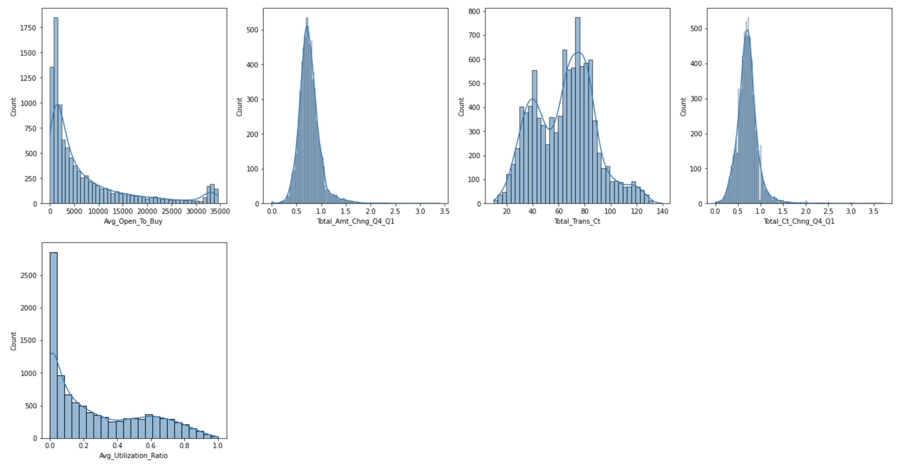

# Bank Churn Prediction
Bank churn, or the loss of customers to other financial institutions, is a significant problem for banks because it can lead to a decline in revenue and profitability. Building a prediction model can help identify at-risk customers and prevent churn by taking targeted interventions to improve the customer experience. This can be done through machine learning and data analytics techniques that identify patterns and trends in customer behavior and inform targeted interventions such as personalized marketing campaigns or improved customer service. Ultimately, building a prediction model to prevent churn can help improve customer loyalty, increase revenue, and reduce the financial impact of customer loss.

## Data Description

The credit card customer data contains information on approximately 10,000 individuals, including their personal characteristics such as age, education level, and marital status, as well as details about their credit card usage. There are a total of 23 columns and 10127 rows in the dataset.

One notable aspect of this dataset is that it is imbalanced, with only 16% of customers having cancelled their credit cards. This can make it challenging to train a model to accurately predict customer turnover, as the model may be biased towards the majority class of customers who have not cancelled their credit cards. As a result, care should be taken when using this dataset to train machine learning models.
## Project Objectives 
- What is the best model to predict and prevent Chun?
- What are the most influential features that have most impact on the churn?
- What metrics are the most suitable to evaluate model?
- What is the financial benefit of using a model to prevent churn?
- Deploy the model using Python Flask for real-time prediction
## Project Structure

- Exploratory data analysis
- Feature Engineering
- Modelling
- Model Performance Evaluation
- Hyper Parameter Tuning (Improve Model Performance)
- Model Interpretation
- Deployment
- Dollar value Evaluation

## Exploratory data analysis(EDA) brief summary
1. __Used a bar plot to assess the balance of the data, ensuring that all categories of the target variable are equally represented.__

----------

2. __Used a frequency table to find the sum of missing values__
 

----------
3. __Catergorical Data__
    * Convert categorical data to numerical data and plot the distribution.
    
    
    
----------
4. __Numerical Data__
    * Plot histograms of numerical data to detect outliers.
    
    
    
----------
    
 
5. __Feature Engineering__
    * Create a new feature called "Revolving_Bal_Per_Relationship" by dividing "Total_Revolving_Bal" by "Total_Relationship_Count".
    * One-hot encode the "Marriage_Status" column to create new columns "Is_Married", "Is_Single", and "Unknown".
    * Use a heatmap to identify the top 5 features that are most correlated with the target variable.
    
 ----------
 
 
6. __EDA Takeaways:__
    * ___We found that this dataset is imbalanced, with a majority of observations belonging to label 0 and a minority belonging to label. This can cause problems when building a model, as it may be biased towards predicting the majority class and not perform well on the minority class. To address this issue, we will use a technique called random oversampling to balance the data and improve model performance.___
    * ___Having no missing values or outliers in this dataset can be beneficial for machine learning because it means the data is relatively clean and free from issues that can distort model performance.___
    * ___The top 5 features that correlated with target are:___
        *  __Total_Trans_Ct__
        *  __Total_Ct_Chng_Q4_Q1__
        *  __Total_Revolving_Bal__
        *  __Contacts_Count_12_mon__
        *  __Avg_Utilization_Ratio__

