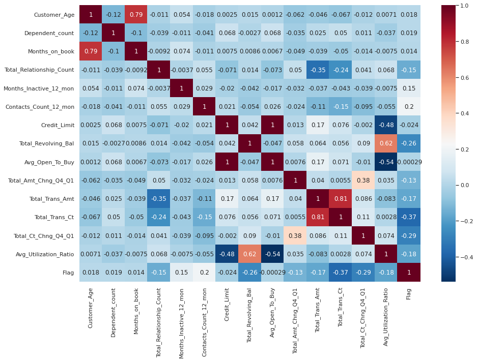
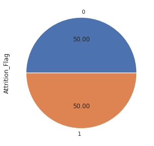
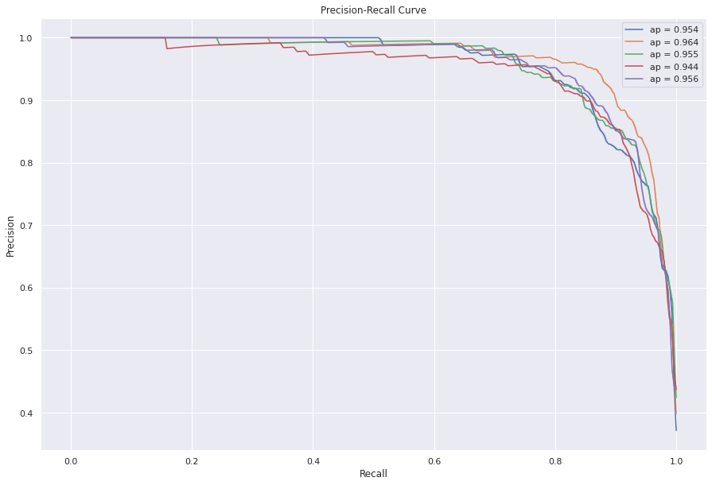
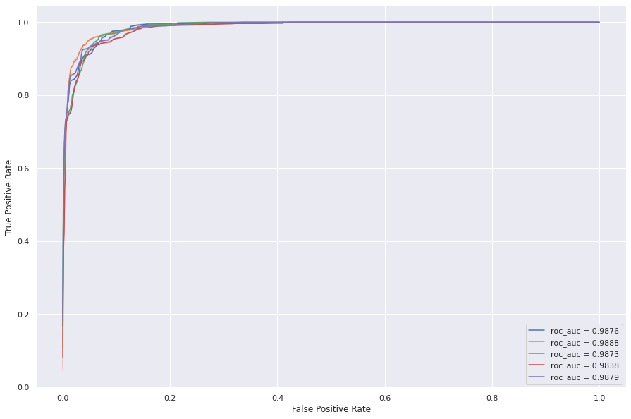
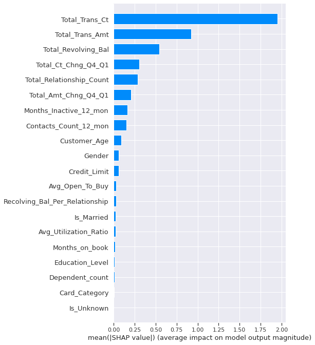

# Bank Churn Prediction
Bank churn, or the loss of customers to other financial institutions, is a significant problem for banks because it can lead to a decline in revenue and profitability.Building a prediction model can help identify at-risk customers and prevent churn by taking targeted interventions to improve the customer experience. Ultimately, building a prediction model to prevent churn can help improve customer loyalty, increase revenue, and reduce the financial impact of customer loss.

[](https://github.com/kliang696/Bank_Churn_Prediction/blob/main/bank_churn_prediction.ipynb)


## Data Description

The credit card customer data in this project contains information on approximately 10,000 individuals, including demographic data such as age, education level, and marital status, as well as details about their credit card usage. There are a total of 23 columns and 10,127 rows in the dataset.

One notable aspect of this dataset is that it is slightly imbalanced, with only 16% of customers having cancelled their credit cards. This can make it challenging to train a model to accurately predict customer turnover, as the model may be biased towards the majority class of customers who have not cancelled their credit cards. As a result, care should be taken when using this dataset to train machine learning models.

## Project Objectives 
- What is the best model to predict and prevent Churn?
- What are the most influential features that impact on the churn?
- What metrics are the most suitable ones to evaluate model?
- What is the financial benefit of using a model to prevent churn?
- Deploying the model using Python Flask for real-time prediction for the new customers

## Project Structure

- Exploratory Data Analysis
- Feature Engineering
- Modelling
- Model Performance Evaluation
- Hyper Parameter Tuning (Improve Model Performance)
- Model Interpretation
- Deployment
- Dollar value Evaluation


## Exploratory Data Analysis and Feature Enginerring Brief Summary
1. __Using frequency table and bar plot to assess the balance of the data, ensuring that all categories of the target variable are equally represented.__
    *   The target variable in this dataset is ```Attrition_Flag```, which indicates whether a customer has left (`1`) or stayed with the company (`0`). There are 8,500 existing customers and 1,627 customers who have left, or "attrited,". In addition, this dataset is imbalanced, with the churning rate of 16%. This can make it difficult for the model to accurately learn and predict the patterns in the data, as the minority class is underrepresented.
    <p align="center">
       
   </p >
       
    <p align="center">
       
      </p>
    


----------

2. __Using a frequency table to find the sum of missing values__
     *   The frequency table indicates that there are no missing or null values in this dataset. This is beneficial for the model because missing or null values can introduce noise and bias into the data, which can negatively impact the model's performance. By having a complete and clean dataset, the model will be able to learn more accurately and make more reliable predictions
         


----------
3. __Catergorical Data__
    * For the categorical data, we convert binary features to 0 and 1. For example, we map ```Existing Customer``` to 0 and ```Attrited Customer``` to 1, and so on, and  For ordinal features that can be ordered, we assign values from 0 to 5 based on their order. For example, for card categories, the lowest level is "blue," so we assign it a value of 0, and "silver" is assigned a value of 1, "gold" is assigned a value of 2, and so on. For nominal features, which cannot be ordered, we will use one-hot encoding to transform them into separate columns in the feature engineering phase.
    
     
    
    
----------
4. __Numerical Data__
    * Plot histograms of numerical data to detect outliers. From the histogram below, we did not find major outliers, which suggests that they are unlikely to have a big impact on our model.
    
    
     * Use a heatmap to identify the top 5 features that are most correlated with the target variable.
       * Heat maps can be helpful to visualize the relationship between two variables, with the strength of the relationship indicated by the intensity of the color.
       
      * The top 5 numerical features that correlated with target are:
        *  ```Total_Trans_Ct```
        *  ```Total_Ct_Chng_Q4_Q1```
        *  ```Total_Revolving_Bal```
        *  ```Contacts_Count_12_mon```
        *  ```Avg_Utilization_Ratio```
    
----------
    
 
5. __Feature Engineering__
    * Create a new feature called ```Revolving_Bal_Per_Relationship = Total_Revolving_Bal / Total_Relationship_Count```
      * Creating new features, can help to improve the performance of a machine learning model by providing additional information for the model to learn from.In this case, by dividing the total revolving balance by the total number of relationships, we can get a sense of the average revolving balance per relationship and how it compares to the overall revolving balance. 
      
   * One-hot encode the ```Marital_Status``` column to create new columns ```Is_Married```, ```Is_Single```, and ```Unknown```.
      * Since the "marry_status" feature is a nominal variable and cannot be ordered, we will use one-hot encoding to transform it into three separate columns: "is_married," "is_single," and "is_unknown." If a customer is married, the "is_married" column will be set to 1, while the other two columns will be set to 0. 
      <p align="center">
       </p>
   
 ----------
 
 
6. __EDA Takeaways:__
    * ___We found that this dataset is imbalanced, with a majority of observations belonging to label 0 and a minority belonging to label 1. This can cause problems when building a model, as it may be biased towards predicting the majority class and not perform well on the minority class.___
    * ___Having no missing values or major outliers in this dataset can be beneficial for machine learning because it means the data is relatively clean and free from issues that can distort model performance.___
    * ___The top 5 features that correlated with target are:___
        *  ```Total_Trans_Ct```
        *  ```Total_Ct_Chng_Q4_Q1```
        *  ```Total_Revolving_Bal```
        *  ```Contacts_Count_12_mon```
        *  ```Avg_Utilization_Ratio```


## Data Over Sampling
Random over-sampling is a technique that is used to balance an imbalanced dataset by generating new synthetic samples from the minority class,which can help the model learn more about the minority class and make more accurate predictions. 
<p align="center">
 </p>


## Evaluation Metrics 
- In this churn problem, our goal is to minimize the customer who actually left bank but the model fails to detect(FN). This is because a failure to detect a customer who has actually left (FN) can result in the bank losing money, while a false alarm (FP) does not have the same issue. Therefore, we will prioritize __recall__ over precision. 
   <p align="center">
  . </p>

## Model Performance with imbalanced & balanced data
- For the model performance, we use Recall, F1, PR AUC, ROC AUC as our main metrics. As this is dataset is imbalanced, we will put more emphasize on Recall, F1 and PR because the TN is not being included in the calculation.  
- The table below shows that the model's performance has significantly improved when using balanced data. The XG Boost classifier outperformed the other two models in this comparison.

<p align="center">
 </p>


## Hyper parameter Tunning & Cross Validation For XG boost 
- Based on the comparison, we have chosen the XG Boost classifier as our primary model. To further improve performance, we will conduct hyperparameter tuning for the XG Boost model to identify the optimal combination of parameters.

```python
   param_grid = {'max_depth': [3, 4, 5],
              'learning_rate': [0.01, 0.02, 0.03],
              'n_estimators': [100, 130, 150]} 
```


- To obtain the best results from hyperparameter tuning, we retrained the XGBoost model using the optimal hyperparameters. We then used 5-fold cross-validation to evaluate the model's performance and took the average of the validation scores as the final measure of the model's performance.

<p align="center">
</p>





## Feature importance
- In this section, we used `SHAP` values to identify the most influential features in the model. We selected the top 5 features based on their `SHAP` values and included them in the model. This allowed us to evaluate the importance of each feature and determine which ones had the greatest impact on the model's performance. The top 5 features are:
  * `Total_Trans_Ct`
  * `Total_Trans_Amt`
  * `Total _Revolving_Bal`
  * `Total _Ct_Chng_04_Q1`
  * `Total_Relationship_Count`
<p align="center">
 </p>

## Model Interpretation
- The `SHAP` summary plot visualizes the importance of each feature in a model for predicting a specific outcome, with the x-axis representing the `SHAP` value and the y-axis ranking the features by importance. The color red indicates a higher value, while blue represents a lower value. From the plot, we can conclude the following insights:
   * Lower values for `Total_Trans_Ct` associated with a higher likelihood of churn. Higher values for `Total_Trans_Ct` associated with a lower likelihood of churn
   * Lower values for `Total _Revolving_Bal` associated with a higher likelihood of churn. Higher values for `Total _Revolving_Bal` associated with a lower likelihood of churn
   * Lower values for `Total _Ct_Chng_04_Q1` associated with a higher likelihood of churn. Higher values for `Total _Ct_Chng_04_Q1` associated with a lower likelihood of churn
   * Lower values for `Total_Relationship_Count` associated with a higher likelihood of churn. Higher values for `Total_Relationship_Count` associated with a lower likelihood of churn

<p align="center">
 </p>

## Dollar Value Evaluation
- This table illustrates the potential savings for the bank using different threshold levels for the model's churn prediction. The column ```dollar value 11``` represents a correct prediction, where the model accurately predicts that a customer will churn and how much money can be saved totally by retaining the customer. The column labeled ```dollar value 10``` represents the model fails to predict that a customer churn but they actually does churn, which resulting in a loss for the bank. The third column ```review counts``` represents the number of customers that the model predicts will churn at different levels. The cost of labor to review these possible churn cases varies based on the number of review counts, and the bank must decide which threshold level is the most suitable for the business.
<p align="center">

 </p>


## Deployment
- In this part of the process, we will use the top 5 most influential features identified by `SHAP` values to build a `XG-Boost` model. We will then deploy this model using Python `Flask` to allow for real-time prediction for the new customers. This will enable us to quickly and efficiently make predictions using the model in a live setting.
<p align="center">
  </p>


## Conclusion


