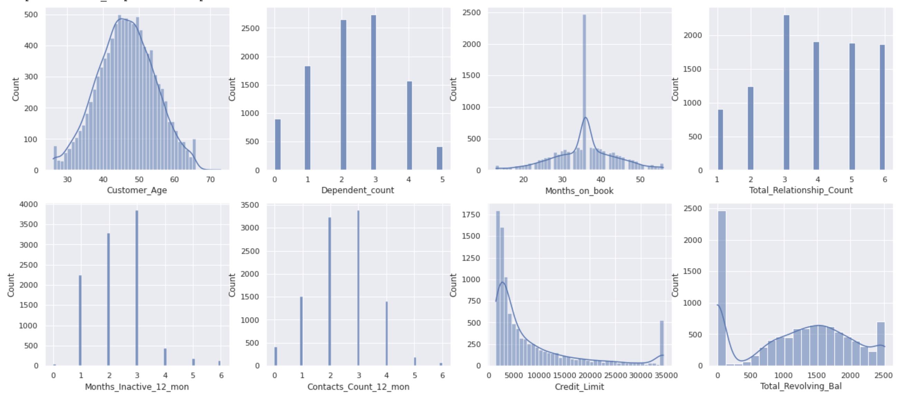
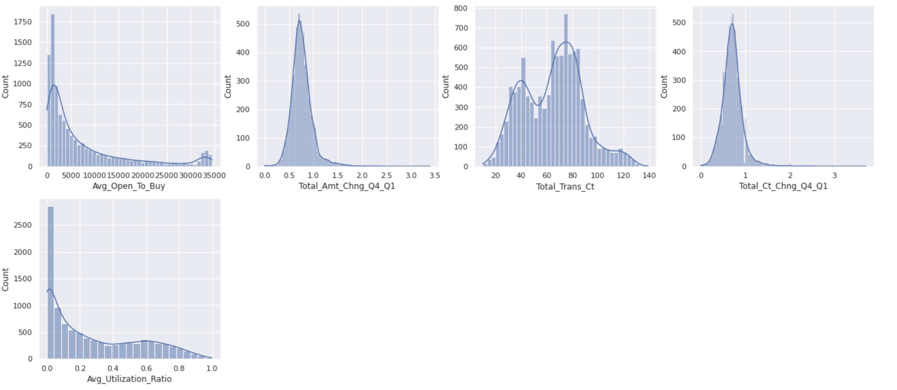
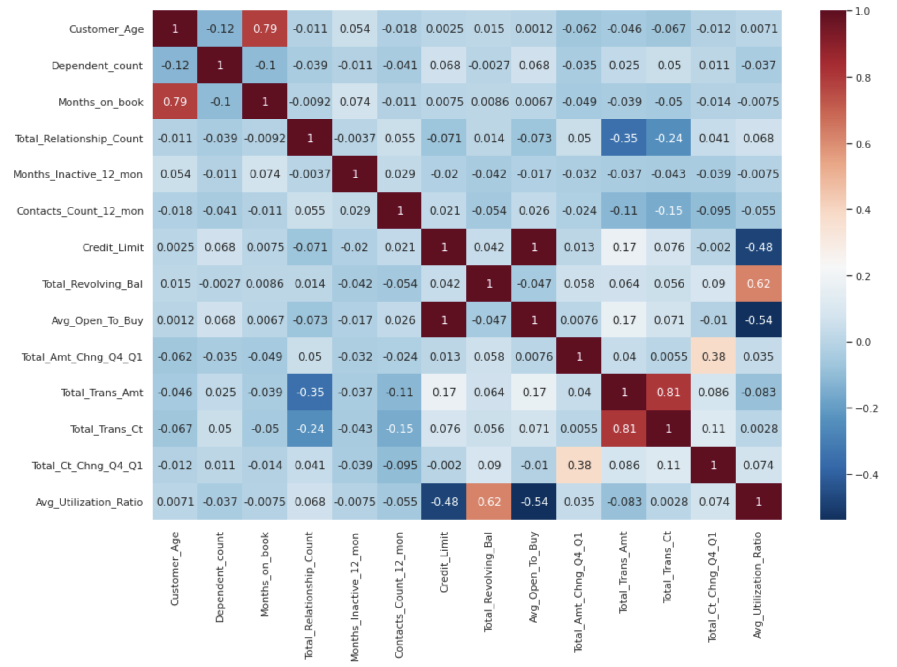

# Bank Churn Prediction
Bank churn, or the loss of customers to other financial institutions, is a significant problem for banks because it can lead to a decline in revenue and profitability. Building a prediction model can help identify at-risk customers and prevent churn by taking targeted interventions to improve the customer experience. This can be done through machine learning and data analytics techniques that identify patterns and trends in customer behavior and inform targeted interventions such as personalized marketing campaigns or improved customer service. Ultimately, building a prediction model to prevent churn can help improve customer loyalty, increase revenue, and reduce the financial impact of customer loss.

## Data Description

The credit card customer data contains information on approximately 10,000 individuals, including their personal characteristics such as age, education level, and marital status, as well as details about their credit card usage. There are a total of 23 columns and 10127 rows in the dataset.

One notable aspect of this dataset is that it is imbalanced, with only 16% of customers having cancelled their credit cards. This can make it challenging to train a model to accurately predict customer turnover, as the model may be biased towards the majority class of customers who have not cancelled their credit cards. As a result, care should be taken when using this dataset to train machine learning models.
## Project Objectives 
- What is the best model to predict and prevent Chun?
- What are the most influential features that have most impact on the churn?
- What metrics are the most suitable to evaluate model?
- What is the financial benefit of using a model to prevent churn?
- Deploy the model using Python Flask for real-time prediction
## Project Structure

- Exploratory data analysis
- Feature Engineering
- Modelling
- Model Performance Evaluation
- Hyper Parameter Tuning (Improve Model Performance)
- Model Interpretation
- Deployment
- Dollar value Evaluation

## Exploratory data analysis(EDA) brief summary
1. __Used frequency table and bar plot to assess the balance of the data, ensuring that all categories of the target variable are equally represented.__
    *   The target variable in this dataset is "Attrition_Flag," which indicates whether a customer has left or stayed with the company. There are 8500 existing customers and 1627 customers who have left, or "attrited,".In addition, this dataset is imbalanced, with 83.93% existing customers and only 16.04% new customers. This can make it difficult for the model to accurately learn and predict patterns, as the minority class is underrepresented.
    *  
    *  
    

----------

2. __Used a frequency table to find the sum of missing values__
     *   The frequency table indicates that there are no missing or null values in this dataset. This is beneficial for the model because missing or null values can introduce noise and bias into the data, which can negatively impact the model's performance. By having a complete and clean dataset, the model will be able to learn more accurately and make more reliable predictions
     *    

----------
3. __Catergorical Data__
    * For the categorical data, we convert binary features to 0 and 1. For example, we map "Existing Customer" to 0 and "Attrited Customer" to 1, and so on, and  For ordinal features that can be ordered, we assign values from 0 to 5 based on their order. For example, for card categories, the lowest level is "blue," so we assign it a value of 0, and "silver" is assigned a value of 1, "gold" is assigned a value of 2, and "platinum" is assigned a value of 3, and so on. For nominal features, which cannot be ordered, we will use one-hot encoding to transform them into separate columns in the feature engineering phase.
    
    * The plot indicates that customers with an income less than $40,000, "Uneducated(0)" and a "blue" level card category have the highest churn rates. This makes sense, as individuals with lower income , lower education level and lower level card status may be more likely to churn. These factors should be taken into consideration in future efforts to reduce churn.
    * 
    
    
----------
4. __Numerical Data__
    * Plot histograms of numerical data to detect outliers.
    
    
    
----------
    
 
5. __Feature Engineering__
    * Create a new feature called "Revolving_Bal_Per_Relationship" by dividing "Total_Revolving_Bal" by "Total_Relationship_Count".
      * Creating new features, or feature engineering, can help to improve the performance of a machine learning model by providing additional information for the model to learn from.In this case, by dividing the total revolving balance by the total number of relationships, we can get a sense of the average revolving balance per relationship and how it compares to the overall revolving balance. This new feature could potentially provide valuable insights into the customer's credit habits and financial behavior.
   * One-hot encode the "Marriage_Status" column to create new columns "Is_Married", "Is_Single", and "Unknown".
      * Since the "marry_status" feature is a nominal variable and cannot be ordered, we will use one-hot encoding to transform it into three separate columns: "is_married," "is_single," and "is_unknown." If a customer is married, the "is_married" column will be set to 1, while the other two columns will be set to 0. This indicates that the customer is married and not single or unknown.
    * Use a heatmap to identify the top 5 features that are most correlated with the target variable.
      * Heat maps can be used to visualize the relationship between two variables, with the strength of the relationship indicated by the intensity of the color.
    
 ----------
 
 
6. __EDA Takeaways:__
    * ___We found that this dataset is imbalanced, with a majority of observations belonging to label 0 and a minority belonging to label 1. This can cause problems when building a model, as it may be biased towards predicting the majority class and not perform well on the minority class. To address this issue, we will use a technique called random oversampling to balance the data and improve model performance.___
    * ___Having no missing values or outliers in this dataset can be beneficial for machine learning because it means the data is relatively clean and free from issues that can distort model performance.___
    * ___Customers with lower income, lower education levels, and lower level card status may be more likely to churn___
    * ___The top 5 features that correlated with target are:___
        *  __Total_Trans_Ct__
        *  __Total_Ct_Chng_Q4_Q1__
        *  __Total_Revolving_Bal__
        *  __Contacts_Count_12_mon__
        *  __Avg_Utilization_Ratio__

